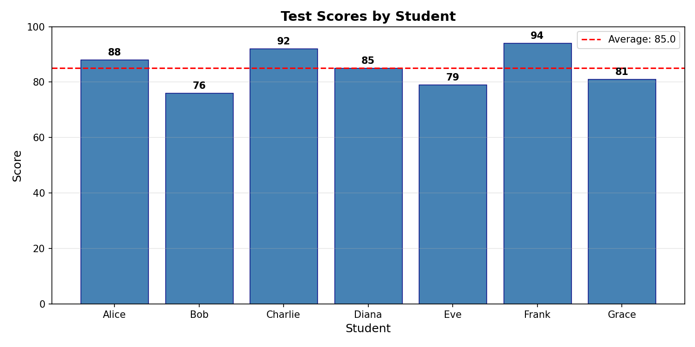
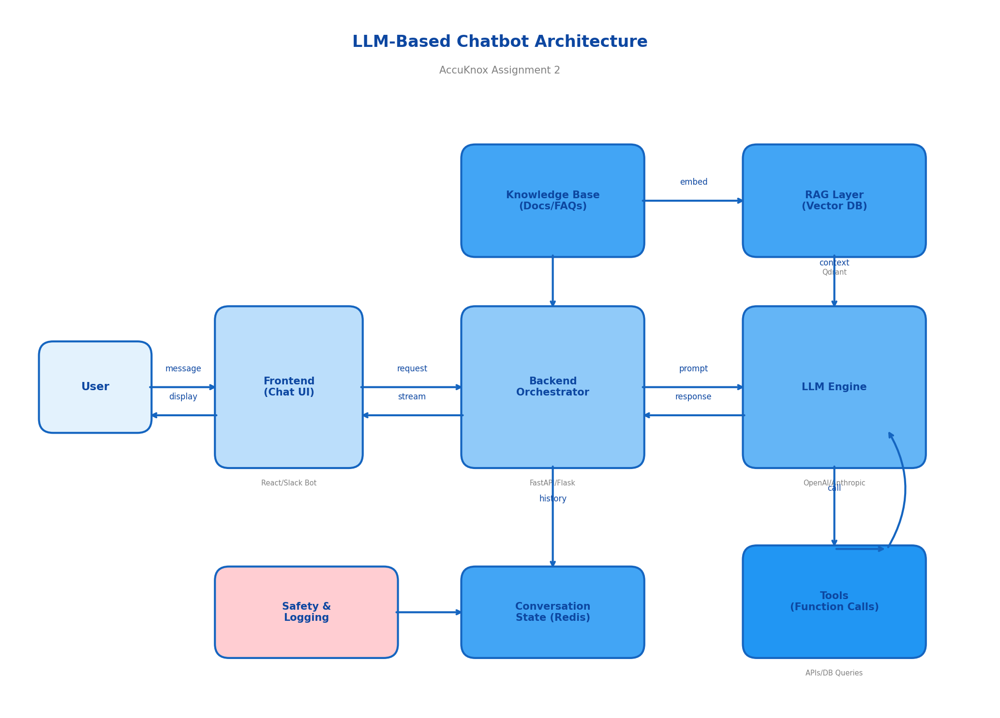

# AccuKnox Assignment

**Anish Sarkar**  
B.Tech (AI & ML), Netaji Subhash Engineering College, Kolkata  


---

## Repository Overview

This repository contains solutions for AccuKnox's technical assessment, covering Python scripting, database operations, data visualization, and system design concepts.

### Referenced Projects
- **Schizophrenia EEG**: [https://github.com/ans036/Schizophrenia_EEG](https://github.com/ans036/Schizophrenia_EEG)
- **Chronic Disease DB**: [https://github.com/ans036/chronic-disease-burden-sqlite](https://github.com/ans036/chronic-disease-burden-sqlite)

---

## Assignment Documents

| Document | Description |
|----------|-------------|
| [ACCUKNOX___ASSIGNMENT_1.docx](docs/ACCUKNOX___ASSIGNMENT_1.docx) | Problem Statement 1 - Python & Database tasks |
| [ACCUKNOX___ASSIGNMENT_2.docx](docs/ACCUKNOX___ASSIGNMENT_2.docx) | Problem Statement 2 - Self-rating, LLM Architecture & Vector DBs |

---

## Assignment 1 – Problem Statement 1

*Full details and code available in: [`docs/ACCUKNOX___ASSIGNMENT_1.docx`](docs/ACCUKNOX___ASSIGNMENT_1.docx)*

### Q1. Fetch Books from API → Store in SQLite → Display

A lightweight ETL pipeline that:
- Fetches book data from an API
- Validates and cleans the data
- Stores in SQLite with uniqueness constraints
- Queries and displays results

**Flow**: API → Python script → SQLite (`books.db`) → Console listing

---

### Q2. Fetch Student Scores → Compute Average → Plot Bar Chart

Data analysis and visualization using pandas + matplotlib:
- Fetches student score data from API
- Computes and displays average score
- Generates professional bar chart with annotations

**Generated Figure**:



---

### Q3. Read Users from CSV → Insert into SQLite

CSV-to-SQLite ingestion with:
- Data cleaning (whitespace trimming, email normalization)
- Idempotent imports using `INSERT OR IGNORE`
- Duplicate handling via `UNIQUE` constraints

---

### Q4. Most Complex Python Code

**Project**: [Schizophrenia Classification using EEG](https://github.com/ans036/Schizophrenia_EEG)

Pipeline features:
- Extracts PSD/DE/SE features from EEG signals
- Generates ~50k scalp heatmaps
- Chrononet-inspired CNN for patient classification
- Achieves ~99% classification accuracy

---

### Q5. Most Complex Database Code

**Project**: [Chronic Disease Burden SQLite](https://github.com/ans036/chronic-disease-burden-sqlite)

Features:
- Realistic SQLite schema (patients, clinicians, chronic conditions, visits, lab_results, risk_scores, alerts)
- Python scripts for data seeding and rule-based scoring
- Mirrors patient-level data handling from Doyen Diagnostics internship

---

## Assignment 2 – Problem Statement 2

*Full details available in: [`docs/ACCUKNOX___ASSIGNMENT_2.docx`](docs/ACCUKNOX___ASSIGNMENT_2.docx)*

### Q1. Self-Rating: LLM, Deep Learning, AI, ML

| Area | Rating | Justification |
|------|--------|---------------|
| **ML** | A | Built and deployed end-to-end pipelines, including semi-supervised disease-burden modeling at Doyen Diagnostics |
| **Deep Learning** | A | CNNs for EEG/video, DNNs for health scores, scientific ML for tumor-immune dynamics |
| **LLM** | A | Built LLM-based apps and games at Jadavpur University, comfortable with RAG and prompt engineering |
| **AI (general)** | B | Solid understanding of core concepts (search, planning, RL), but less production experience compared to ML/DL |

---

### Q2. High-Level LLM Chatbot Architecture



**Components**:

1. **Frontend / Chat UI** – React web app or Slack bot for authentication, message streaming, response display

2. **Backend API Service** – FastAPI/Flask exposing `/chat` endpoint with rate limiting and input validation

3. **Conversation State** – Short-term (Redis) and long-term (DB) storage for context management

4. **Knowledge & Retrieval (RAG Layer)** – Offline document ingestion with embeddings; online query with top-k retrieval

5. **LLM Engine** – Model API (OpenAI/Anthropic) wrapped with system prompt, history, and context

6. **Tools / Function Calling** – `get_current_alerts()`, `describe_policy()`, `run_k8s_check()` with backend execution

7. **Safety, Logging, Monitoring** – Content filters, PII scrubbing, latency/token metrics

---

### Q3. Vector Databases

**What is a Vector Database?**

A database optimized for storing high-dimensional embeddings and performing efficient approximate nearest-neighbor (ANN) search. Key features:
- ANN algorithms (HNSW, IVF)
- Metadata filtering
- CRUD on vectors
- Horizontal scaling

**Hypothetical Use Case: Cloud Security Copilot**

For a CNAPP-integrated chatbot:
- Answer questions grounded in alerts, misconfigurations, and security findings
- Multi-tenant data isolation

**Why Qdrant?**

1. Open-source with HNSW indexing
2. Rich payload support for metadata filtering (`tenant_id`, `severity`, `cluster`)
3. Self-hosted or managed deployment options (critical for security workloads)

**Pipeline**:
```
Ingestion: CNAPP alerts/docs → Chunk → Embed → Upsert to Qdrant with metadata

Query: User question → Embed → Query Qdrant (with filters) → Retrieve top-k → LLM generates response
```

---

## Assignment Structure

```
accuknox-assignment/
├── README.md
├── docs/
│   ├── ACCUKNOX___ASSIGNMENT_1.docx   # Assignment 1 - Full solutions
│   └── ACCUKNOX___ASSIGNMENT_2.docx   # Assignment 2 - Full solutions
└── figures/
    ├── scores.png                      # Generated bar chart (Q2)
    └── llm_chatbot_architecture.png    # Architecture diagram (Q2.2)
```

---

## License

This project is for assessment purposes.

---

## Contact

**Anish Sarkar**  
Email:  [ani.tubai022@gmail.com]
